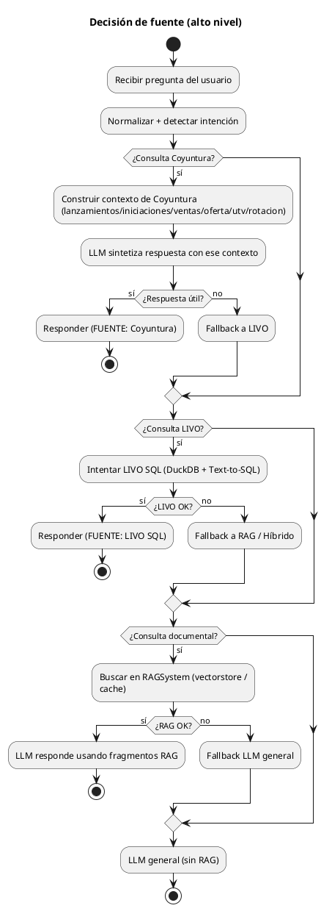
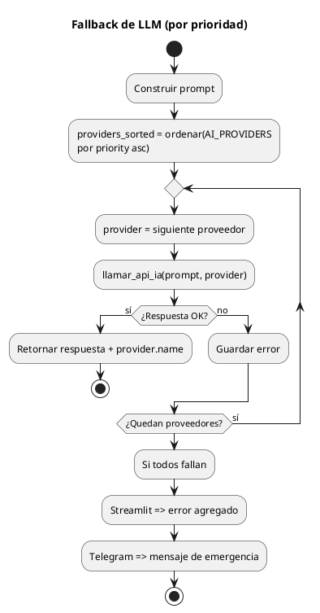

# Diagrama de decisiones del agente (prioridades, fallbacks y timeouts)

Este documento describe **cómo decide el agente** qué fuente usar (Coyuntura / LIVO / RAG / LLM) y **cómo enruta entre proveedores de LLM**, basado en el código actual del proyecto.

---

## 1) Resumen ejecutivo (orden de decisión)

En **Streamlit** (`app.py`) existe un flujo explícito de prioridad:

1. **Coyuntura** (módulos `*_coyuntura.py`) si la pregunta parece de coyuntura.
2. **LIVO SQL** (`livo_sql.py`) si hay indicadores/datos tipo LIVO o si Coyuntura cae.
3. **RAG** (`rag_system.py`) si hay intención documental o si LIVO no resuelve.
4. **LLM general** (multi-proveedor) como fallback final.

En **Telegram** (`bot_telegram.py`) la orquestación es similar pero con más énfasis en:

- análisis/seguridad y orquestación avanzada (`advanced_reasoning.py`)
- logging de interacciones

---

## 2) Diagrama de decisión global (fuentes)

---

## 3) Lógica de Coyuntura (detalles)

### 3.1 Detección
En `app.py` se detecta por palabras clave y “palabras de análisis”.

### 3.2 Orden interno
En `procesar_consulta_coyuntura(...)` el agente:

- intenta construir `contexto_coyuntura` desde los sistemas disponibles
- llama un LLM para redactar usando ese contexto
- si no da respuesta útil, hace fallback:

1. **LIVO SQL**
2. **RAG**
3. **LLM general**

---

## 4) Lógica de LIVO (detalles)

En `procesar_con_prioridad_livo(...)` (Streamlit):

- usa `rag_system.buscar_con_analisis(...)` para detectar si hay archivos de datos relevantes
- si detecta LIVO y está disponible:
  - Prioriza **DuckDB + Text-to-SQL** (`livo_sql.consultar(...)`)
  - si falla, puede hacer fallback a Pandas (más lento)
- si no responde, pasa a un sistema híbrido (RAG + análisis sobre archivos)

En Telegram existe detección `es_consulta_livo(...)` y también inicialización de `LIVOSQLSystem`.

---

## 5) Prioridad de proveedores LLM (orden real)

El orden lo define `config.AI_PROVIDERS` por el campo `priority` (menor número = más prioridad).

Orden actual (según `config.py`):

1. **Groq** (`priority=1`)
2. **Google Gemini** (`priority=2`)
3. **DeepSeek** (`priority=3`)
4. **OpenAI** (`priority=4`)
5. **Ollama Llama 3.1 local** (`priority=5`)
6. **Ollama Qwen 2.5 local** (`priority=6`)
7. **Ollama Mistral local** (`priority=7`)
8. **Cerebras** (`priority=9`)
9. **Mistral AI** (`priority=10`)
10. **HuggingFace** (`priority=14`)
11. **Gemini (prioridad baja)** (`priority=15`)
12. **DeepSeek (prioridad baja)** (`priority=16`)

---

## 6) Qué pasa si un LLM no responde (fallback)

### 6.1 Mecanismo de fallback

- En **Telegram**: `bot_telegram.py` implementa `obtener_respuesta_ia(prompt)`
- En **Streamlit**: `app.py` también implementa `obtener_respuesta_ia(prompt)`

Ambos hacen:

- Ordenar proveedores por `priority`
- Iterar secuencialmente
- Si un proveedor falla (no responde o retorna error), se intenta el siguiente
- Si **todos** fallan:
  - En Streamlit: devuelve `None` + mensaje agregando el detalle de errores
  - En Telegram: usa un **fallback de emergencia** (mensaje fijo informando problemas técnicos)

### 6.2 Timeouts reales (cuánto espera antes de saltar)

Los timeouts están en `llm_providers.py` y dependen del proveedor:

- **OpenAI-compatible** (DeepSeek/OpenAI/Cerebras/Mistral): `timeout=30s`
- **Gemini**: `timeout=30s`
- **Groq**: `timeout=120s`
- **Ollama** (local): `timeout=120s` (y maneja `ConnectionError`/`Timeout`)
- **HuggingFace**: `timeout=60s`

> No hay un “timeout global” adicional. El salto al siguiente proveedor ocurre cuando la llamada HTTP retorna (o expira por timeout).

### 6.3 ¿Hay retries automáticos, backoff o paralelismo?

- **No** se observan retries/backoff automáticos.
- **No** hay llamadas en paralelo; es **secuencial**.

---

## 7) ¿Cómo hace búsqueda en internet?

### 7.1 En tiempo de conversación (agente respondiendo)

En el código actual **no hay un módulo de búsqueda web en vivo** (tipo Google/Bing/DuckDuckGo) que el agente use para responder preguntas en tiempo real.

### 7.2 Scraping / recolección (offline)

Sí existen scripts de scraping para **alimentar el RAG**:

- `web_scraper.py`: scrapea URLs de sitios (ej. camacol.co) y guarda listas/URLs.
- `rag_system.py`: incluye utilidades para **descargar archivos desde URLs** y procesarlos para indexación.

Esto sirve para:

- recolectar documentos
- indexarlos en el RAG

Pero no es una “búsqueda web” en vivo durante la conversación.

---

## 8) Diagrama: fallback de LLM (routing)

---

## 9) Si quieres cambiar el comportamiento (recomendaciones)

Si quieres que el sistema sea más “agente” y robusto, normalmente se agrega:

- **Timeout máximo global** por respuesta (ej. 20-40s total) para no esperar 120s por Groq
- **Circuit breaker**: si un proveedor falla varias veces seguidas, saltarlo por X minutos
- **Retries** solo para errores transitorios (HTTP 429/503) con backoff
- **Búsqueda web en vivo** con un conector (SerpAPI/Bing API) y un módulo de verificación/citación

Si me confirmas los objetivos (p.ej. tiempo máximo por respuesta), te genero un diagrama “ideal” y/o implementamos el cambio en código.
