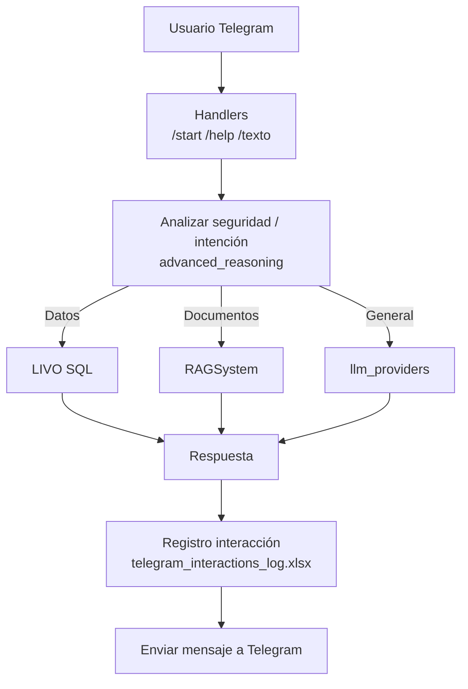

# Mapa de arquitectura y relaciones - Chatbot CAMACOL

Este documento describe **qué hace cada parte del proyecto** y **cómo se relaciona** con el resto.

Incluye diagramas en **Mermaid**, listos para pegar en:

- GitHub Markdown (si Mermaid está habilitado)
- Mermaid Live Editor
- Notion/Obsidian (con soporte Mermaid)

---

## 1) Vista general

El proyecto tiene **dos puntos de entrada principales**:

- **`app.py`**: interfaz web en **Streamlit**.
- **`bot_telegram.py`**: bot en **Telegram** (polling).

Ambos comparten la misma “lógica de inteligencia”:

- **Multi-proveedor de LLM** (`llm_providers.py` + `config.py`)
- **RAG** (búsqueda en documentos) (`rag_system.py` + carpeta `RAG/` + `rag_cache/`)
- **Datos estructurados (LIVO)** via **DuckDB + Text-to-SQL** (`livo_sql.py`)
- **Sistemas de coyuntura** (módulos `*_coyuntura.py`)
- **Razonamiento/clarificación** (`reasoning_system.py`, `advanced_reasoning.py`)

---

## 2) Diagrama de componentes (alto nivel)

```mermaid
graph TD
  subgraph Canales
    ST[Streamlit UI\napp.py]
    TG[Telegram Bot\nbot_telegram.py]
    WA[WhatsApp (preparado)\nwhatsapp_integration.py]
  end

  subgraph Core
    CFG[Config\nconfig.py]
    LLM[LLM Router\nllm_providers.py]
    RAG[RAG Engine\nrag_system.py]
    LIVO[LIVO SQL\nlivo_sql.py]
    RS[Reasoning\nreasoning_system.py]
    AR[Advanced Reasoning\nadvanced_reasoning.py]
    FB[Feedback\nfeedback_system.py]
  end

  subgraph Datos
    RAGF[(Documentos\nRAG/)]
    RC[(Cache\nrag_cache/)]
    XLS[(Excel / CSV / PDF\nvarios)]
    FL[(Logs\nfeedback_log.json\ntelegram_interactions_log.xlsx)]
  end

  ST --> CFG
  ST --> LLM
  ST --> RAG
  ST --> LIVO
  ST --> RS

  TG --> CFG
  TG --> LLM
  TG --> RAG
  TG --> LIVO
  TG --> RS
  TG --> AR
  TG --> FB

  WA --> LLM
  WA --> AR

  RAG --> RAGF
  RAG --> RC
  LIVO --> XLS
  FB --> FL
  TG --> FL
```

---

## 3) Puntos de entrada

### 3.1 `app.py` (Streamlit)

- **Rol**: UI web del chatbot.
- **Qué inicializa**:
  - `RAGSystem` (si está disponible)
  - `LIVOSQLSystem` (con cache de Streamlit)
  - `ReasoningSystem`
- **Qué hace**:
  - Maneja `st.session_state`
  - Decide el **tipo de consulta** (LIVO / Coyuntura / RAG / general)
  - Construye prompts, llama LLM, arma respuesta final

### 3.2 `bot_telegram.py` (Telegram)

- **Rol**: bot conversacional por Telegram.
- **Qué inicializa**:
  - Carga `.env` (con `python-dotenv`) y exige `TELEGRAM_TOKEN`
  - Intenta inicializar:
    - `RAGSystem`
    - `ReasoningSystem`
    - `LIVOSQLSystem`
- **Qué hace**:
  - Registra interacciones (Excel)
  - Usa `advanced_reasoning` para análisis y respuesta
  - Usa `llm_providers.llamar_api_ia` para llamadas a modelos

---

## 4) Núcleo de IA (Multi-proveedor)

### 4.1 `config.py`

- **Rol**: configuración estática del chatbot.
- **Contenido clave**:
  - Enum `AIModel`
  - Lista `AI_PROVIDERS` (prioridades, modelos, variable env de la API key)

### 4.2 `llm_providers.py`

- **Rol**: “router” para llamar proveedores.
- **Entradas**:
  - `prompt`
  - `provider_config` (desde `config.AI_PROVIDERS`)
- **Salidas**:
  - `(respuesta, error)`

También carga `ethical_constitution.md` para autocorrección/supervisión interna.

---

## 5) RAG (Retrieval-Augmented Generation)

### 5.1 `rag_system.py`

- **Rol**: indexa documentos y busca fragmentos relevantes.
- **Entradas**:
  - `rag_folder` (carpeta `RAG/`)
- **Salidas**:
  - búsqueda por `k` resultados
  - contexto para el LLM

- **Dependencias esperadas**:
  - LangChain + FAISS + embeddings (si están instalados)

### 5.2 `inicializar_rag.py`

- **Rol**: script para inicializar/cachear el vectorstore.
- **Uso**: se ejecuta **cuando agregas o cambias documentos**.

### 5.3 Carpeta `RAG/` y `rag_cache/`

- `RAG/`: documentos fuente (PDF/DOCX/XLSX/CSV/PPTX, etc.) organizados por año/tema.
- `rag_cache/`: cache del vectorstore y hashes.

---

## 6) LIVO SQL (DuckDB + Text-to-SQL)

### 6.1 `livo_sql.py`

- **Rol**: consulta rápida a datos LIVO.
- **Idea**:
  - Cargar el Excel LIVO
  - Exponer consultas textuales -> generar SQL -> ejecutar en DuckDB

`app.py` y `bot_telegram.py` lo usan como fuente de datos prioritaria cuando detectan que la pregunta es de tipo “datos”.

---

## 7) Sistemas de coyuntura

Módulos principales (cada uno aporta contexto/consultas específicas):

- `lanzamientos_coyuntura.py`
- `iniciaciones_coyuntura.py`
- `ventas_coyuntura.py`
- `oferta_coyuntura.py`
- `utv_coyuntura.py`
- `rotacion_coyuntura.py`
- `comparacion_coyuntura.py`

`app.py` arma una estrategia de fallback típica:

- Coyuntura -> LIVO SQL -> RAG -> LLM general

---

## 8) Razonamiento y orquestación

### 8.1 `reasoning_system.py`

- **Rol**: detectar preguntas incompletas, clarificar intención y/o enrutar.

### 8.2 `advanced_reasoning.py`

- **Rol**: orquestación de respuesta “de alto nivel” (prioriza LIVO, luego RAG, luego análisis causal y respuesta final).

---

## 9) Integraciones adicionales

### 9.1 WhatsApp (preparado)

- `whatsapp_config.py`: configuración (tokens placeholders).
- `whatsapp_integration.py`: integración API (estado “preparado”).

---

## 10) Scripts auxiliares / generación de RAG

Hay varios scripts para poblar/organizar RAG:

- `generar_rag_*.py`
- `organizar_por_anio.py`
- `web_scraper.py`

Su objetivo típico es:

- Descargar/organizar documentos
- Convertir a formatos indexables
- Alimentar el sistema RAG

---

## 11) Flujo de decisión (Streamlit)

Diagrama simplificado del flujo típico en `app.py`:

```mermaid
flowchart TD
  Q[Usuario escribe pregunta\n(UI Streamlit)] --> N[Normalización / detección]

  N -->|Coyuntura| C[procesar_consulta_coyuntura]
  N -->|LIVO| L[procesar_con_prioridad_livo]
  N -->|RAG| R[procesar_consulta_rag]
  N -->|General| G[LLM general]

  C -->|ok| OUT[Respuesta final]
  C -->|fallback| L

  L -->|ok| OUT
  L -->|fallback| R

  R -->|ok| OUT
  R -->|fallback| G

  G --> OUT
```

---

## 12) Flujo de decisión (Telegram)

Diagrama simplificado del flujo en `bot_telegram.py`:



---

## 13) Glosario (archivos clave)

- `app.py`: UI Streamlit + orquestación principal web.
- `bot_telegram.py`: orquestación principal Telegram.
- `config.py`: lista de proveedores/modelos + prioridades.
- `llm_providers.py`: llamadas HTTP a proveedores (Groq/Gemini/OpenAI/DeepSeek/etc.) y autocorrección.
- `rag_system.py`: indexado/búsqueda documental.
- `inicializar_rag.py`: inicialización del cache de RAG.
- `livo_sql.py`: consultas a LIVO usando DuckDB.
- `*_coyuntura.py`: sistemas especializados para indicadores de coyuntura.
- `reasoning_system.py`: clarificación/intención.
- `advanced_reasoning.py`: estrategia avanzada (priorizar LIVO, luego RAG, etc.).

---

## 14) Notas prácticas para diagramadores

Si vas a usar un generador de diagramas que no soporte Mermaid, puedo exportarte el mismo contenido en:

- PlantUML (`.puml`)
- Draw.io XML (si me dices el estilo)

