# Mapa de tests y relaciones (qué prueba cada test y si entra al flujo principal)

Este documento resume los archivos `test_*.py` del proyecto:

- qué prueban
- a qué módulos apuntan
- si forman parte del **flujo principal** (`app.py` / `bot_telegram.py`) o son scripts auxiliares

> Nota: la mayoría de estos archivos son **scripts ejecutables** (con `main()` o prints) y NO están conectados automáticamente a un runner como `pytest`.

---

## 1) ¿Los tests entran al flujo principal?

- **Flujo principal (runtime)**: `app.py`, `bot_telegram.py`.
- Los `test_*.py`:
  - **No se importan** desde `app.py` o `bot_telegram.py`.
  - Se ejecutan manualmente (ej: `python test_reasoning.py`).

Por lo tanto:

- **Están desconectados del flujo principal**.
- Sirven para:
  - verificación local
  - validación de reglas
  - pruebas de integración
  - auditorías masivas

---

## 2) Diagrama de relaciones (tests -> módulos)

```plantuml
@startuml
skinparam wrapWidth 240
skinparam maxMessageSize 220
skinparam componentStyle rectangle

title Relación de tests con módulos del sistema

package "Flujo principal (runtime)" {
  [Streamlit\n(app.py)] as APP
  [Telegram\n(bot_telegram.py)] as TG
}

package "Módulos core" {
  [Reasoning\n(reasoning_system.py)] as RS
  [Coyuntura\n(lanzamientos/iniciaciones/oferta...)] as COY
  [LIVO SQL\n(livo_sql.py)] as LIVO
  [RAG\n(rag_system.py)] as RAG
  [LLM Router\n(llm_providers.py)] as LLM
  [Visualización\n(visualization_system.py)] as VIZ
  [Integración Streamlit\n(streamlit_integration.py)] as STINT
  [Config/Providers\n(config.py)] as CFG
}

package "Tests (scripts)" {
  [test_local.py] as TLOCAL
  [test_apis.py] as TAPIS
  [test_modelos.py] as TMODELOS

  [test_reasoning.py] as TREAS
  [test_variables_criticas_livo.py] as TVAR
  [test_periodos_temporales.py] as TPER
  [test_definiciones_temporales_correctas.py] as TDEF
  [test_clasificacion_temporal.py] as TCT
  [test_clasificacion_valor.py] as TCV
  [test_clasificacion_valor_simple.py] as TCVS
  [test_salario_oficial_2025.py] as TSAL

  [test_lanzamientos_coyuntura.py] as TLAN
  [test_iniciaciones_coyuntura.py] as TINI
  [test_oferta_coyuntura.py] as TOFE

  [test_automatic_charts.py] as TCH
  [test_visualization_integration.py] as TVIZ

  [test_preguntas_clave.py] as TMASS
}

' Flujo principal usa módulos core
APP --> RS
APP --> COY
APP --> LIVO
APP --> RAG
APP --> LLM
APP --> VIZ

TG --> RS
TG --> LIVO
TG --> RAG
TG --> LLM
TG --> VIZ

' Tests apuntan a módulos core (pero no al flujo principal)
TLOCAL --> APP : verifica existencia/config
TLOCAL --> CFG

TAPIS --> LLM : llamadas HTTP directas
TAPIS --> CFG

TMODELOS --> CFG : (API key Gemini)

TREAS --> RS
TVAR --> RS
TPER --> RS
TDEF --> RS
TCT --> RS
TCV --> RS
TCV --> LIVO
TCVS --> RS
TSAL --> LIVO

TLAN --> COY
TLAN --> RS
TINI --> COY
TINI --> RS
TINI --> TLAN : comparación ini vs lan
TOFE --> COY

TCH --> LIVO
TVIZ --> VIZ
TVIZ --> LIVO
TVIZ --> STINT

TMASS --> LIVO
TMASS --> RAG
TMASS --> LLM
TMASS --> RS

@enduml
```

---

## 3) Tabla: qué prueba cada test

### 3.1 Smoke tests / verificación local

- **`test_local.py`**
  - **Objetivo**: verificar que el entorno local esté listo.
  - **Qué prueba**:
    - que exista `app.py`
    - que dependencias mínimas existan
    - que exista `.streamlit/secrets.toml` y tenga `GOOGLE_API_KEY`
  - **Conexión al flujo principal**: desconectado (ejecución manual).

### 3.2 Tests de conectividad de APIs / LLM

- **`test_apis.py`**
  - **Objetivo**: smoke test de conectividad a proveedores.
  - **Qué prueba**:
    - requests directos a Groq/Gemini/DeepSeek/Cerebras
    - prueba local de Ollama con timeout variable por modelo
  - **Conexión al flujo principal**: desconectado.

- **`test_modelos.py`**
  - **Objetivo**: probar qué modelos de Gemini responden.
  - **Qué prueba**: `google.generativeai` contra lista de modelos.
  - **Conexión al flujo principal**: desconectado.
  - **Riesgo**: contiene API key hardcodeada (no recomendado en repos).

### 3.3 Tests del sistema de razonamiento (Reasoning)

Estos tests validan reglas que sí son relevantes al flujo principal, porque `app.py` / `bot_telegram.py` usan `reasoning_system`.

- **`test_reasoning.py`**
  - **Objetivo**: demostrar y validar clarificación de preguntas.
  - **Qué prueba**:
    - detección de preguntas incompletas
    - generación de contrapreguntas
    - casos LIVO: importancia de `cuenta`, COUNT DISTINCT, NIT constructora, etc.
  - **Conexión al flujo principal**: desconectado como script, pero valida lógica usada en runtime.

- **`test_variables_criticas_livo.py`**
  - **Objetivo**: validar detección de variables críticas (cuenta/estado/fase/usos/modalidad...).
  - **Qué prueba**: `ReasoningSystem.analyze_question()` y revisión de comentarios/recomendaciones.
  - **Conexión al flujo principal**: desconectado como script; lógica aplica al runtime.

- **`test_periodos_temporales.py`**
  - **Objetivo**: validar interpretación de periodos temporales (año corrido, últimos N meses, formato YYYYMMDD).
  - **Qué prueba**: `ReasoningSystem` + una función auxiliar `analyze_and_respond` local al test.
  - **Conexión al flujo principal**: desconectado.

- **`test_definiciones_temporales_correctas.py`**
  - **Objetivo**: validar definiciones “correctas” de periodos (año corrido / último año / últimos N meses).
  - **Qué prueba**: `ReasoningSystem` buscando comentarios relacionados.
  - **Conexión al flujo principal**: desconectado.

- **`test_clasificacion_temporal.py`**
  - **Objetivo**: validar que la clasificación VIS/VIP/NO_VIS cambia por año.
  - **Qué prueba**:
    - cálculo de rangos por salario mínimo por año
    - generación de SQL temporal `CASE ... WHEN año ...`
    - detección de aspectos temporales en `ReasoningSystem`
  - **Conexión al flujo principal**: desconectado.

- **`test_clasificacion_valor.py`**
  - **Objetivo**: validar migración de clasificación por `tipo_vivienda` hacia rangos por `valor`.
  - **Qué prueba**:
    - `SalarioMinimoColombiano` y rangos
    - `LIVOSQLSystem.obtener_rangos_vivienda_sql()`
    - recomendaciones desde `ReasoningSystem`
  - **Conexión al flujo principal**: desconectado.

- **`test_clasificacion_valor_simple.py`**
  - **Objetivo**: versión simplificada/independiente del test anterior.
  - **Qué prueba**: lógica equivalente sin depender de `livo_sql.SalarioMinimoColombiano`.
  - **Conexión al flujo principal**: desconectado.

- **`test_salario_oficial_2025.py`**
  - **Objetivo**: validar rangos con salario mínimo oficial 2025.
  - **Qué prueba**: cálculo de rangos y condiciones SQL en miles.
  - **Conexión al flujo principal**: desconectado.

### 3.4 Tests de Coyuntura (datos precargados)

- **`test_lanzamientos_coyuntura.py`**
  - **Objetivo**: validar sistema de coyuntura de lanzamientos.
  - **Qué prueba**:
    - estadísticas generales
    - contexto por periodo
    - tendencias recientes
    - comparación departamental
    - generación de contexto por consulta
    - integración con `ReasoningSystem`
  - **Conexión al flujo principal**: desconectado como script; el módulo coyuntura sí se usa en `app.py`.

- **`test_iniciaciones_coyuntura.py`**
  - **Objetivo**: validar coyuntura de iniciaciones.
  - **Qué prueba**: similar a lanzamientos + comparación contra lanzamientos.
  - **Conexión al flujo principal**: desconectado.

- **`test_oferta_coyuntura.py`**
  - **Objetivo**: pruebas unitarias con `unittest` para coyuntura de oferta.
  - **Qué prueba**:
    - inicialización
    - estructura de datos
    - departamentos esperados
    - agregaciones regionales
    - totales/distribuciones
  - **Conexión al flujo principal**: desconectado.

### 3.5 Tests de visualización / gráficos

- **`test_automatic_charts.py`**
  - **Objetivo**: validar la decisión automática de si generar gráfico según texto.
  - **Qué prueba**: `LIVOSQLSystem.should_generate_chart(pregunta, result)`.
  - **Conexión al flujo principal**: desconectado (pero apoya funcionalidades que podrían integrarse al runtime).

- **`test_visualization_integration.py`**
  - **Objetivo**: prueba de integración del módulo `visualization_system.py` para Streamlit y Telegram.
  - **Qué prueba**:
    - detección de tipo de visualización
    - generación por canal (`streamlit`, `telegram`)
    - verifica integración con LIVO (métodos `_generar_grafico`, `should_generate_chart`)
    - recomienda integrar en `app.py` via `streamlit_integration.py`
  - **Conexión al flujo principal**: desconectado.

### 3.6 Auditoría masiva / simulación de agente

- **`test_preguntas_clave.py`**
  - **Objetivo**: auditoría masiva (+200 preguntas) y export a Excel.
  - **Qué prueba**:
    - ruteo simulado del agente:
      - LIVO/Coyuntura por reglas
      - Dynamic Excel
      - RAG
    - inicialización real de motores:
      - `LIVOSQLSystem`
      - `RAGSystem` (carga cache)
      - `DynamicExcelSQLSystem`
    - usa `llm_providers` (si está disponible) para consultas dinámicas
  - **Conexión al flujo principal**: desconectado.

---

## 4) Conclusión

- Los `test_*.py` **no forman parte del flujo principal**.
- Sí son útiles para:
  - validar reglas críticas que afectan runtime (Reasoning / Coyuntura / LIVO)
  - comprobar APIs y modelos
  - pruebas de integración de visualización
  - auditoría masiva del ruteo del agente

Si quieres, también puedo generar un **diagrama Mermaid** equivalente, o una matriz CSV para Excel/Confluence.
